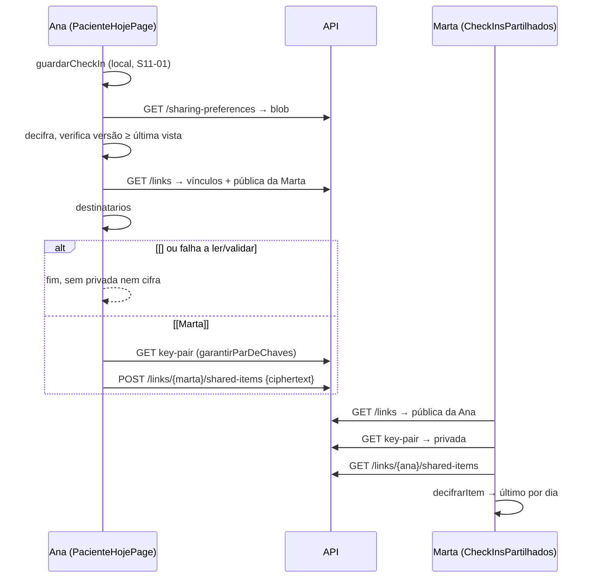

# S11-02 · Forma: partilha seletiva cifrada de check-ins (paciente → profissional)

Decisões e alternativas: `.harness/abordagem/S11-02.md`. Cenário: `Specs/S11 Partilha e espelho P6.md` § Cenário E2E, passos 6-8.
Nada toca em `Features/Accounts/**`.

## 0. Migração

Nenhuma. Os envelopes partilhados e os blobs de preferências vivem em memória, no `PatientLinkStore`, com o mesmo teto dos vínculos. `0010` fica livre.

## 1. API · contrato

```csharp
// PatientLinks/PatientLink.cs  (+)
public sealed record SharedItem(Guid ProfessionalAccountId, Guid PatientAccountId, DateTimeOffset SharedAt, byte[] Ciphertext);
public sealed record SharingPreferences(long Version, byte[] WrappedDek, byte[] Ciphertext);   // opaco: KEK da conta

// PatientLinks/PatientLinkStore.cs  (+4 métodos, mesmo lock; Unlink não mexe em _sharedItems nem em _preferences)
public bool Share(Guid patientAccountId, Guid professionalAccountId, byte[] ciphertext);                     // false = não há vínculo com esta paciente → esta profissional
public IReadOnlyList<SharedItem>? ListShared(Guid professionalAccountId, Guid patientAccountId);             // null = não há vínculo; ordem de chegada
public SharingPreferences? GetPreferences(Guid accountId);                                                    // null = nunca gravado
public Result<SharingPreferences, long> PutPreferences(Guid accountId, long expectedVersion, byte[] wrappedDek, byte[] ciphertext);
//   atual?.Version ?? 0 == expectedVersion → grava Version = expectedVersion + 1 │ senão Failure(versão atual)
// ponytail: sem teto de itens por vínculo; teto = memória do processo. Upgrade: tabela junto com patient_links.

// PatientLinks/SharedItemEndpoints.cs  (novo; 4 rotas; handlers recebem PatientLinkStore, sem serviço)
public sealed record ShareItemRequest(byte[] Ciphertext);
public sealed record SharedItemView(DateTimeOffset SharedAt, byte[] Ciphertext);
public sealed record PutSharingPreferencesRequest(long ExpectedVersion, byte[] WrappedDek, byte[] Ciphertext);
public sealed record SharingPreferencesView(long Version, byte[] WrappedDek, byte[] Ciphertext);
internal const int MaxBlobBytes = 64 * 1024;

// PatientLinks/PatientLinksProblemCodes.cs  (+2 → regenerar problem-codes.ts, + problem-messages.ts)
public const string SharingPreferencesNotFound = "sharing.preferences_not_found";
public const string SharingVersionConflict     = "sharing.version_conflict";
```

| Verbo · rota | Corpo → resposta | Estados |
|---|---|---|
| `POST /accounts/{accountId}/links/{peerAccountId}/shared-items` | `{ciphertext}` → — | 204 · 400 `ciphertext` < 28 bytes (`TryValidateSealedBlobShape`) ou > 64 KiB · 401 `auth.access_token_invalid` · 403 `auth.forbidden` · 404 `link.not_found` (sem vínculo em que `accountId` é a paciente e `peer` a profissional) |
| `GET /accounts/{accountId}/links/{peerAccountId}/shared-items` | → `SharedItemView[]` | 200 · 401 · 403 · 404 `link.not_found` (sem vínculo em que `accountId` é a profissional e `peer` a paciente) |
| `GET /accounts/{accountId}/sharing-preferences` | → `{version, wrappedDek, ciphertext}` | 200 · 401 · 403 · 404 `sharing.preferences_not_found` |
| `PUT /accounts/{accountId}/sharing-preferences` | `{expectedVersion, wrappedDek, ciphertext}` → `{version}` | 200 · 400 `expectedVersion` < 0, blob < 28 bytes ou > 64 KiB · 401 · 403 · 409 `sharing.version_conflict` (a versão atual ≠ `expectedVersion`; 0 = criar) |

401 e 403 vêm do `RequireAccountAccessMiddleware` (rota `{accountId}`), sem guarda no handler. JsonContext: `+ShareItemRequest, SharedItemView, IReadOnlyList<SharedItemView>, PutSharingPreferencesRequest, SharingPreferencesView`.

```
POST shared-items ── middleware ─401/403 ── shape/Max ─400 ── store.Share (lock: link P=acc,Pro=peer? → append) ─false→404 │ 204
GET  shared-items ── middleware ─401/403 ── store.ListShared (lock: link Pro=acc,P=peer?) ─null→404 │ 200
GET  preferences  ── middleware ─401/403 ── store.GetPreferences ─null→404 │ 200
PUT  preferences  ── middleware ─401/403 ── expectedVersion≥0, shape×2, Max ─400 ── store.PutPreferences (lock: CAS) ─409 │ 200 {version}
```

## 2. App · contrato

Decisão pós-forma (S11-02, slice "refactor lint:arch"): `entities/partilha` não pode importar
`Vinculo`/`CheckIn` de outras entidades (`fsd-no-cross-slice`). O orquestrador e tudo o que precisa
de conhecer `Vinculo`/`CheckIn` ao mesmo tempo que o estado de partilha subiu para
`features/partilha`; `entities/partilha` ficou só com cifra, preferências e o cliente HTTP, sobre
uma chave opaca (`string`).

```ts
// entities/partilha/partilha.ts   (puro; cego a Vinculo/CheckIn)
export type TipoPartilhavel = 'checkin'
export type EstadoPartilha = Readonly<Record<string, Readonly<Partial<Record<TipoPartilhavel, true>>>>>  // chave = string opaca
export function comPartilha(estado: EstadoPartilha, chave: string, tipo: TipoPartilhavel, ativa: boolean): EstadoPartilha

// entities/partilha/preferencias.ts   (blob no servidor; AAD `limmiar/partilha-estado/v1|<accountId>`; plaintext { versao, estado })
// última versão vista: localStorage `limmiar:partilha-versao:<accountId>` (inteiro, só sobe)
export class RollbackDePreferencias extends Error {}
export function lerEstadoPartilha(p: { baseUrl: string; accountId: string; accessToken: string; kek: CryptoKey }): Promise<{ versao: number; estado: EstadoPartilha }>
//   404 → { versao: 0, estado: {} } │ 200 → decifra; versao interna ≠ version do fio ou < última vista → lança RollbackDePreferencias │ senão sobe a última vista
export function definirPartilha(p: { baseUrl; accountId; accessToken; kek; chave: string; tipo: TipoPartilhavel; ativa: boolean }): Promise<EstadoPartilha>
//   ler → comPartilha → cifra { versao: v+1 } → PUT expectedVersion v → 409: uma nova tentativa (ler → reaplicar), segundo 409 lança │ 200 → sobe a última vista

// entities/partilha/cifra.ts   (getSharedSecret → deriveChannelKey(ss, salt) → aes-gcm encrypt/decrypt; salt = aad = `limmiar/partilha/v1|<paciente>|<profissional>`; payload opaco)
export function cifrarItem(p: { privadaPaciente: Uint8Array; publicaProfissional: Uint8Array; pacienteAccountId: string; profissionalAccountId: string; item: unknown }): Uint8Array
export function decifrarItem(p: { privadaProfissional: Uint8Array; publicaPaciente: Uint8Array; pacienteAccountId: string; profissionalAccountId: string; ciphertext: Uint8Array }): unknown

// entities/partilha/api.ts
export function enviarItemPartilhado(baseUrl, accountId, accessToken, profissionalAccountId, ciphertext: Uint8Array): Promise<{ ok: true } | ProblemResult>
export function listarItensPartilhados(baseUrl, accountId, accessToken, pacienteAccountId): Promise<{ ok: true; itens: { partilhadoEm: string; ciphertext: Uint8Array<ArrayBuffer> }[] } | ProblemResult>
export function obterPreferenciasPartilha(baseUrl, accountId, accessToken): Promise<{ ok: true; versao: number; wrappedDek: Uint8Array<ArrayBuffer>; ciphertext: Uint8Array<ArrayBuffer> } | ProblemResult>
export function gravarPreferenciasPartilha(baseUrl, accountId, accessToken, b: { versaoEsperada: number; wrappedDek: Uint8Array; ciphertext: Uint8Array }): Promise<{ ok: true; versao: number } | ProblemResult>

// features/partilha/partilha.ts   (orquestrador; conhece Vinculo/CheckIn)
export type ItemPartilhado = { tipo: 'checkin'; checkin: CheckIn }
export function chaveDoVinculo(v: Vinculo): string                       // `${profissionalAccountId}|${vinculadoEm}`: um vínculo novo nunca herda partilha
export function destinatarios(estado: EstadoPartilha, vinculos: readonly Vinculo[], pacienteAccountId: string, tipo: TipoPartilhavel): Vinculo[]
//   = vínculos com pacienteAccountId === eu, toggle ativo (estado[chaveDoVinculo(v)]) e chavePublicaDoPar !== null

// features/partilha/partilhar-checkin.ts   (o módulo profundo; a única porta de "cifrar para a profissional")
export function partilharCheckIn(p: { baseUrl: string; accountId: string; accessToken: string; kek: CryptoKey; checkin: CheckIn }): Promise<{ partilhadoCom: string[] }>
//   lança se ler preferências/listar/enviar falhar (falha fechada); NUNCA pede a privada nem cifra se destinatarios = []

// pages/paciente-hoje/PacienteHojePage.tsx   (+ prop opcional; ausente = S11-01 intacto, zero rede)
export interface PacienteHojePageProps { accountId: string | null; kek: CryptoKey | null; agora?: Date; partilha?: { baseUrl: string; accessToken: string } }
//   Estado + { status: 'salvo-sem-partilha' }

// features/partilha/PartilhaCheckIns.tsx     (paciente) props { baseUrl, accountId, accessToken, kek }
// features/partilha/CheckInsPartilhados.tsx  (profissional) props { baseUrl, accountId, accessToken, kek }
```

## 3. Call trees e texto



```
PacienteHojePage.guardar
└─ guardarCheckIn ─erro→ 'erro'
   └─ partilha? ─não→ 'salvo'
      └─ partilharCheckIn ─lança→ 'salvo-sem-partilha'  (sem retry: a decisão é do momento da gravação)
         ├─ lerEstadoPartilha ─falha/rollback→ lança
         ├─ listarVinculos · destinatarios ─[]→ return
         ├─ garantirParDeChaves
         └─ ∀ dest: cifrarItem → enviarItemPartilhado

PartilhaCheckIns     mount: lerEstadoPartilha · listarVinculos → checkbox por vínculo "Compartilhar check-ins com esta profissional"
                     ─falha/rollback→ alerta, checkbox desativada
                     onChange: definirPartilha → texto de estado │ 409 duplo/erro → alerta, volta ao estado lido
CheckInsPartilhados  mount: garantirParDeChaves · listarVinculos (onde sou profissional)
                     └─ ∀ vínculo: listarItensPartilhados → decifrarItem → <li>dia: sono/ansiedade · frase</li> | "Nenhum check-in compartilhado."
```

Texto em pt-BR, com a fonte como id do macro Lingui (`lingui extract` + 4 `.po`):
- rótulo: "Compartilhar check-ins com esta profissional"
- ativo: "Os check-ins que você registrar a partir de agora são compartilhados com esta profissional."
- revogado, `role="status"`: "Compartilhamento de check-ins desativado. O que muda: os check-ins que você registrar a partir de agora não são compartilhados. O que não muda: os check-ins já compartilhados continuam com a profissional, que pode já tê-los lido, e a Limmiar não consegue apagá-los. O vínculo continua ativo."
- falha na leitura: "Não foi possível carregar suas preferências de compartilhamento. Nada novo será compartilhado até que elas carreguem."
- página: "Check-in salvo neste dispositivo, mas não foi compartilhado."
- profissional: "Nenhum check-in compartilhado."
- `problem-messages.ts`: `sharing.preferences_not_found` → "Nenhuma preferência de compartilhamento salva."; `sharing.version_conflict` → "Suas preferências mudaram em outro dispositivo. Tente novamente."

## 4. Seams de teste e fatias TDD

| Seam | Técnica | Prova |
|---|---|---|
| HTTP (`WebApplicationFactory`, `PatientLinkEndpointsTests.CreateFactory`) | integração | tabela §1: sucesso, 400, 401, 403, 404 por direção invertida e depois de desvincular, 409 de versão |
| `PatientLinkStore` | unitário | `Share` sem vínculo → false; `Unlink` não apaga itens; voltar a vincular devolve os anteriores; `PutPreferences` CAS (`Parallel.For` com a mesma `expectedVersion`: um só vence) |
| `cifra.ts` (chaves reais de `generateKeyPair`) | unitário | ida e volta; terceira profissional não decifra; AAD invertida falha |
| `preferencias.ts` (fetch falso, KEK real de teste, jsdom localStorage) | unitário | 404 → versão 0; blob mais antigo do que a última vista → `RollbackDePreferencias`; `version` do fio ≠ interna → lança; 409 → relê e reaplica; segundo 409 lança; a última vista só sobe |
| `partilharCheckIn` (servidor falso em memória com versões, crypto real) | propriedade (`fast-check`) | ∀ sequência de `ativar\|revogar\|gravar(dia)\|servidorRepõeBlobAntigo`: POST ⇔ toggle ativo na última versão validada nesse instante; blob reposto → zero POST; todo POST decifra com a privada da Marta; nada anterior sai do servidor falso |
| idem | negativo | toggle desligado ou GET de preferências a falhar → zero `GET key-pair`, zero POST, `encrypt` nunca chamado |
| Playwright, 2 contextos + API | E2E | passos 6-8 |

1. **Tracer, vermelho primeiro:** `SharedItemEndpointsTests.PatientShares_ThenProfessionalLists_ReturnsSameCiphertext`. Verde: records, `Share/ListShared`, endpoints, JsonContext. Depois `Post_WhenAccountIsProfessionalSide_Returns404`, `Get_WhenAccountIsPatientSide_Returns404`, `Get_AfterUnlink_Returns404`, `Post_WithShortCiphertext_Returns400`, `Post_WithOversizedCiphertext_Returns400`, 401/403; `PatientLinkStoreTests.Unlink_KeepsSharedItems_RelinkListsThem`.
2. `SharingPreferencesEndpointsTests.Put_ThenGet_ReturnsSameBlobWithVersion1` → `Get_WhenNeverSaved_Returns404`, `Put_WithStaleExpectedVersion_Returns409`, `Put_WithNegativeVersion_Returns400`, blobs 400, 401/403; `PatientLinkStoreTests.PutPreferences_ConcurrentSameExpectedVersion_ExactlyOneWins`. Regenerar `problem-codes.ts` e juntar as mensagens.
3. `cifra.test.ts` "a profissional decifra o que a paciente cifrou" → terceira conta falha, AAD trocada falha.
4. `partilha.test.ts` (`destinatarios`, `comPartilha`, `chaveDoVinculo`: vínculo novo não herda) · `api.test.ts` · `preferencias.test.ts` "rejeita um blob mais antigo do que a última versão vista".
5. `partilhar-checkin.test.ts` "item não partilhado nunca é cifrado com a pública da profissional", "falha a ler preferências não partilha" → `partilhar-checkin.property.test.ts`.
6. `PacienteHojePage.test.tsx` (+ sem `partilha` nenhum fetch; falha de partilha → mensagem, check-in local fica) · `PartilhaCheckIns.test.tsx` (texto da revogação exato; alerta de falha) · `CheckInsPartilhados.test.tsx` · `E2ePartilhaScaffold.test.tsx` · rota.
7. `e2e/partilha-checkin.spec.ts`, em serial, com a preparação dos passos 1-5 via API e fixtures:
   - 6 `a paciente ativa o compartilhamento e o check-in de hoje sai cifrado para a profissional, e o servidor só vê ciphertext` (também afirma que o corpo do `PUT sharing-preferences` não contém o id da Marta nem "checkin" em claro)
   - 7 `a profissional decifra no dispositivo dela o check-in compartilhado`
   - 8 `a paciente revoga: o check-in de amanhã não é cifrado para a profissional, o de hoje continua visível e a tela diz isso sem prometer apagar`
   (8 também afirma: zero POST `shared-items` para amanhã; o `GET` da Marta traz exatamente 1 envelope, decifrado = hoje; `GET /links` das duas continua com o vínculo e as públicas.)

## 5. ficheiros_previstos

```
apps/api/src/Api/Features/PatientLinks/PatientLink.cs                 + SharedItem, SharingPreferences
apps/api/src/Api/Features/PatientLinks/PatientLinkStore.cs            + Share, ListShared, GetPreferences, PutPreferences
apps/api/src/Api/Features/PatientLinks/SharedItemEndpoints.cs         4 rotas + records de fio
apps/api/src/Api/Features/PatientLinks/PatientLinksComposition.cs     MapSharedItemEndpoints + JsonContext
apps/api/src/Api/Features/PatientLinks/PatientLinksProblemCodes.cs    + sharing.preferences_not_found, sharing.version_conflict
apps/api/src/Api/Features/PatientLinks/README.md
apps/api/tests/Api.Tests/PatientLinks/SharedItemEndpointsTests.cs
apps/api/tests/Api.Tests/PatientLinks/SharingPreferencesEndpointsTests.cs
apps/api/tests/Api.Tests/PatientLinks/PatientLinkStoreTests.cs
apps/app/package.json                                                  + devDependency fast-check ^4.9.0 (e lockfile)
apps/app/src/shared/api/problem-codes.ts (gerado) · problem-messages.ts
apps/app/src/entities/partilha/{partilha,preferencias,cifra,api}.ts
apps/app/src/entities/partilha/{partilha,preferencias,cifra,api}.test.ts
apps/app/src/entities/partilha/README.md
apps/app/src/features/partilha/{partilha,partilhar-checkin}.ts             (orquestrador; movido de entities/partilha no refactor lint:arch)
apps/app/src/features/partilha/{partilha,partilhar-checkin,partilhar-checkin.property}.test.ts
apps/app/src/features/partilha/{PartilhaCheckIns,CheckInsPartilhados}{,.test}.tsx
apps/app/src/features/partilha/README.md
apps/app/src/pages/paciente-hoje/{PacienteHojePage,PacienteHojePage.test}.tsx
apps/app/src/pages/paciente-hoje/README.md
apps/app/src/app/routing/{E2ePartilhaScaffold,E2ePartilhaScaffold.test}.tsx · router.tsx   /e2e/partilha?baseUrl&accountId&accessToken&kek&papel&agora
apps/app/src/locales/{pt-BR,en-US,es-419,it-IT}/messages.po
apps/app/e2e/partilha-checkin.spec.ts · apps/app/e2e/vinculo-chave-publica.spec.ts (comentário dos passos 6-8 aponta para o novo spec)
apps/api/README.md · ARCHITECTURE.md                                   índice
```

## 6. READMEs

- `Features/PatientLinks/README.md`: +4 rotas. Invariantes: a direção vem da rota; o servidor só guarda envelopes e blobs opacos, nunca vê o tipo nem o estado do compartilhamento; `version` é só CAS otimista; desvincular não apaga itens (esconde-os até haver vínculo); revogar só muda o blob.
- `entities/partilha/README.md` (novo): `partilharCheckIn` é a única porta. Zero destinatários = zero cifra. Salt e AAD. Blob com `versao` autenticada e a última vista local, que só sobe. Falha fechada. Sem retry. Confiança no primeiro uso num dispositivo novo.
- `features/partilha/README.md` (novo): os dois ecrãs e o texto da revogação como invariante. Sem montagem de produção (não há `KeychainProvider`).
- `pages/paciente-hoje/README.md`: a invariante "nenhum pedido de rede" passa a ser "nenhum pedido de rede sem a prop `partilha`".
- `entities/checkin/README.md`: sem mudança. `apps/api/README.md` e `ARCHITECTURE.md`: uma linha.

## 7. Riscos

- **Dispositivo novo (TOFU):** sem última versão vista, um blob antigo reposto pelo servidor no primeiro GET não é detetado. Fica documentado.
- **Última versão vista apagada** (limpar dados do site): o dispositivo volta a TOFU. Nunca partilha a mais do que o blob autenticado diz.
- **Editar o check-in de hoje depois de revogar:** a edição não é compartilhada e a Marta continua a ver a versão anterior. Confirmado pelo humano.
- **Sem rede ao gravar:** o check-in fica local e não é partilhado, nem depois. É intencional.
- **O servidor pode omitir ou reordenar envelopes** (não pode forjar nem ler). Fora de âmbito, como a verificação de fingerprint no ADR-S11-06.
- **E2E partido no main:** `playwright.config.ts` não passa `AbacatePay__WebhookSecret` (dívida S12). Localmente, corre com a env var. Não se corrige aqui.
- `status` duplicado na página do E2E (lição do S11-04): usar `getByText` e não `getByRole('status')` puro.
